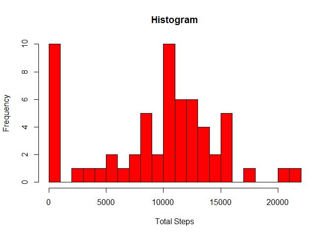
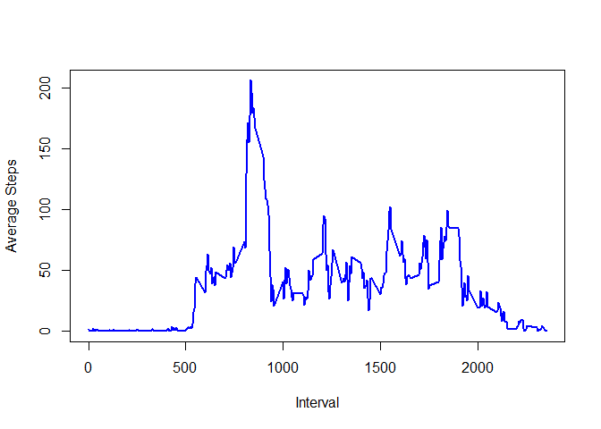
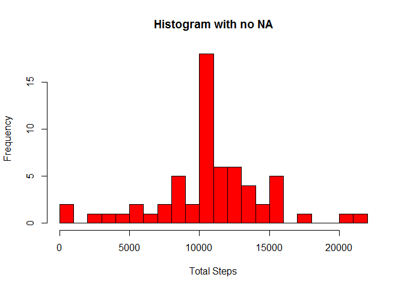
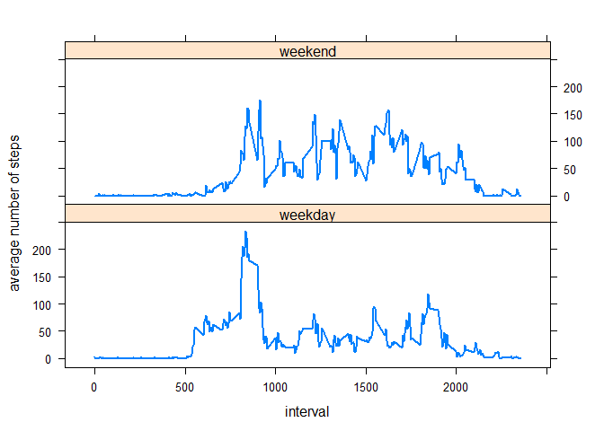

# Reproducible Research: Peer Assessment 1
## *by* Yamila M. Omar


### Initial Notes
All the code presented here was run within the directory that corresponds to the
cloned Github repository. You **only** need to clone the "repo" and run the
code below.


### Loading and preprocessing the data

**1. Load the data.**

The first step is to load the data. We have to unzip it because the cloned repo
contains the raw data as a zipped file called "activity.zip". We will show the
first 10 rows of the data for reference.


```r
data <- read.table(unz("activity.zip", "activity.csv"), header=TRUE, sep=",")
head(data, 10)
```

```
##    steps       date interval
## 1     NA 2012-10-01        0
## 2     NA 2012-10-01        5
## 3     NA 2012-10-01       10
## 4     NA 2012-10-01       15
## 5     NA 2012-10-01       20
## 6     NA 2012-10-01       25
## 7     NA 2012-10-01       30
## 8     NA 2012-10-01       35
## 9     NA 2012-10-01       40
## 10    NA 2012-10-01       45
```

**2. Process/transform the data (if necessary) into a format suitable for your analysis**

We can check the class of the data calling the following **R** functions:


```r
class(data)
```

```
## [1] "data.frame"
```

```r
class(data$steps)
```

```
## [1] "integer"
```

```r
class(data$date)
```

```
## [1] "factor"
```

```r
class(data$interval)
```

```
## [1] "integer"
```

As shown by the results above, the data in column "date" is not the appropriate
class. So I will change it.


```r
library(lubridate)
```

```
## Warning: package 'lubridate' was built under R version 3.2.1
```

```r
data$date <- as.Date(as.character(data$date), "%Y-%m-%d")
str(data)
```

```
## 'data.frame':	17568 obs. of  3 variables:
##  $ steps   : int  NA NA NA NA NA NA NA NA NA NA ...
##  $ date    : Date, format: "2012-10-01" "2012-10-01" ...
##  $ interval: int  0 5 10 15 20 25 30 35 40 45 ...
```

The data does not need any further processing.


### What is mean total number of steps taken per day?

**1. Make a histogram of the total number of steps taken each day**

To answer this question, we will make a data frame where we will store the
following information in each column:

- day

- total number of steps

The following code will allow you to visualize the first 10 rows of data which
will be stored in the variable "data_summary"


```r
library(dplyr)
```

```
## Warning: package 'dplyr' was built under R version 3.2.1
```

```
## 
## Attaching package: 'dplyr'
## 
## The following objects are masked from 'package:lubridate':
## 
##     intersect, setdiff, union
## 
## The following objects are masked from 'package:stats':
## 
##     filter, lag
## 
## The following objects are masked from 'package:base':
## 
##     intersect, setdiff, setequal, union
```

```r
data_summary <- data %>% group_by(date) %>% 
                         summarize(total.steps = sum(steps, na.rm = TRUE))
head(data_summary, 10)
```

```
## Source: local data frame [10 x 2]
## 
##          date total.steps
## 1  2012-10-01           0
## 2  2012-10-02         126
## 3  2012-10-03       11352
## 4  2012-10-04       12116
## 5  2012-10-05       13294
## 6  2012-10-06       15420
## 7  2012-10-07       11015
## 8  2012-10-08           0
## 9  2012-10-09       12811
## 10 2012-10-10        9900
```

Now we are required to make a histogram of the total number of steps taken each 
day.


```r
hist(data_summary$total.steps, breaks = 20, main = "Histogram", 
     xlab = "Total Steps", col = "red")
```

 

**2. Calculate and report the mean and median total number of steps taken per day.**

We do it as follows:


```r
mean(data_summary$total.steps)
```

```
## [1] 9354.23
```

```r
median(data_summary$total.steps)
```

```
## [1] 10395
```


### What is the average daily activity pattern?

**1. Make a time series plot (i.e. type = "l") of the 5-minute interval (x-axis) and the average number of steps taken, averaged across all days (y-axis).**

To understand this question, we must notice that if we call the "unique" function on the column "interval" of our "data" data frame, as show below:


```r
unique(data$interval)
```

the result shows 288 unique values. These correspond to the 1440 minutes in 1 day subdivided in groups of 5 minutes each. So what we have to do, for the y-axis, is to average the steps of all days at intervals corresponding to 0, 5, 10, etc minutes.


```r
data_interval <- data %>% group_by(interval) %>% 
                          summarize(av.steps = mean(steps, na.rm = TRUE))
with(data_interval, plot(interval, av.steps, type = "l",lwd = 2, col = "blue",
                         xlab = "Interval", ylab = "Average Steps"))
```

 

**2. Which 5-minute interval, on average across all the days in the dataset, contains the maximum number of steps?**

This can be answered as:


```r
aux <- which.max(data_interval$av.steps)
data_interval$interval[aux]
```

```
## [1] 835
```


### Imputing missing values

**1. Calculate and report the total number of missing values in the dataset (i.e. the total number of rows with NAs)**


```r
sum(is.na(data$steps))
```

```
## [1] 2304
```

**2. Devise a strategy for filling in all of the missing values in the dataset. The strategy does not need to be sophisticated. For example, you could use the mean/median for that day, or the mean for that 5-minute interval, etc.**

I will fill the rows with "NA" values with the average step for that time interval as calculated in our data frame called "data_interval"

**3. Create a new dataset that is equal to the original dataset but with the missing data filled in.**


```r
no.NA.data <- data
for(i in 1: length(no.NA.data$steps)){
        if(is.na(no.NA.data$steps[i])){
                aux.interval <- no.NA.data$interval[i]
                aux.position <- which(data_interval$interval == aux.interval)
                no.NA.data$steps[i] <- data_interval$av.steps[aux.position]
                }
}
head(no.NA.data, 10)
```

```
##        steps       date interval
## 1  1.7169811 2012-10-01        0
## 2  0.3396226 2012-10-01        5
## 3  0.1320755 2012-10-01       10
## 4  0.1509434 2012-10-01       15
## 5  0.0754717 2012-10-01       20
## 6  2.0943396 2012-10-01       25
## 7  0.5283019 2012-10-01       30
## 8  0.8679245 2012-10-01       35
## 9  0.0000000 2012-10-01       40
## 10 1.4716981 2012-10-01       45
```

**4. Make a histogram of the total number of steps taken each day and calculate and report the mean and median total number of steps taken per day. Do these values differ from the estimates from the first part of the assignment? What is the impact of imputing missing data on the estimates of the total daily number of steps?**


```r
no.NA.data_summary <- no.NA.data %>% group_by(date) %>% 
                                     summarize(total.steps = sum(steps))
hist(no.NA.data_summary$total.steps, breaks = 20, main = "Histogram with no NA", 
     xlab = "Total Steps", col = "red")
```

 

```r
mean(no.NA.data_summary$total.steps)
```

```
## [1] 10766.19
```

```r
median(no.NA.data_summary$total.steps)
```

```
## [1] 10766.19
```

Having "replaced" the NA values for the average step number for that time interval leads to diferences in the calculated mean and median values. Let's see this in an organized format:


```r
my_table <- data.frame(case = c("original data", "data without NA values"), 
                       means = c(mean(data_summary$total.steps), 
                                 mean(no.NA.data_summary$total.steps)),
                       medians = c(median(data_summary$total.steps), 
                                   median(no.NA.data_summary$total.steps)))
my_table
```

```
##                     case    means  medians
## 1          original data  9354.23 10395.00
## 2 data without NA values 10766.19 10766.19
```

As it can be observed, both mean and median are shifted to the left, i.e. higher values of total steps.


### Are there differences in activity patterns between weekdays and weekends?

**1. Create a new factor variable in the dataset with two levels, "weekday" and "weekend", indicating whether a given date is a weekday or weekend day.**

We start with the original data. We know that it contains three variables (i.e. three columns) called "steps", "date", "interval". We will create a forth column called "date.category" where we will indicate if the day was a weekday or weekend.


```r
aux <- length(data$date)
data <- mutate(data, date.category = rep("weekday", times = aux))
library(chron)
```

```
## Warning: package 'chron' was built under R version 3.2.1
```

```
## 
## Attaching package: 'chron'
## 
## The following objects are masked from 'package:lubridate':
## 
##     days, hours, minutes, seconds, years
```

```r
for(i in 1:length(data$date)){
        if(is.weekend(data$date[i])){data$date.category[i] = "weekend"}
}
data$date.category <- as.factor(data$date.category)
```

**2. Make a panel plot containing a time series plot (i.e. type = "l") of the 5-minute interval (x-axis) and the average number of steps taken, averaged across all weekday days or weekend days (y-axis).**


```r
data_wday <- data %>% group_by(date.category, interval) %>% 
                        summarize(av.steps = mean(steps, na.rm = TRUE))
library(lattice)
```

```
## Warning: package 'lattice' was built under R version 3.2.1
```

```r
xyplot(av.steps ~ interval | date.category, data = data_wday, layout = c(1, 2),
       type = "l", lwd = 2, ylab = "average number of steps")
```

 
